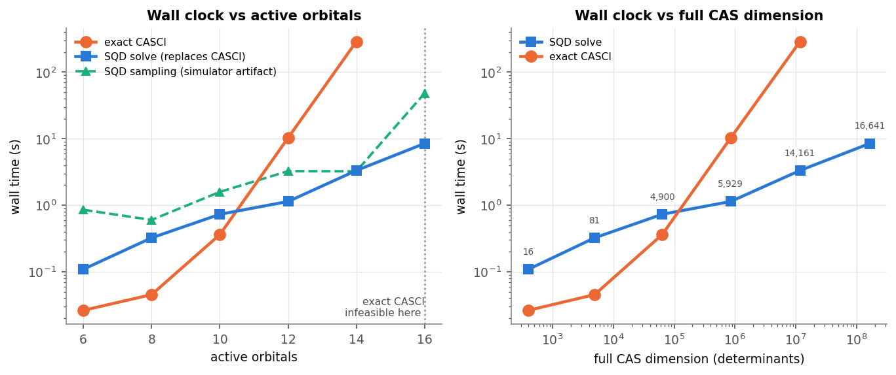

# What we have run — methods, timings, results

## Results at a glance

| active space | qubits | determinants | CASCI (exact) | SQD | **J (cm⁻¹)** |
|---|---|---|---|---|---|
| (10e,10o) Fe 3d | 20 | 63,504 | −5013.64906670 | **+0.0000 mHa** | **28.8** |
| (22e,16o) + bridging S 3p | 32 | 19,079,424 | −5013.72724223 | **+34.5 mHa** | **46.7** |
| (26e,18o) + Fe 4s | 36 | 73,410,624 | 4/6 sectors (GPU) | +653 mHa *(hardware)* | **82.0** * |
| DMRG (30e,20o) TZP-DKH | — | — | — | — | 236 |
| **Experiment** | — | — | — | — | **148 ± 16** |

\* fitted from the four spin sectors we could compute (S = 2–5); the two largest exceeded the memory budget. Adding the fourth moved J from 84.3 to 82.0, i.e. the fit is converging, not drifting.

**J: 28.8 → 46.7 → 82.0 cm⁻¹** — the chemistry converges toward experiment as the active
space stops truncating it. Full detail and all caveats in **`RESULTS_MASTER.md`**.


**Real hardware:** run on IBM `ibm_fez` (job `dameitg2fm4c73f2t3f0`), 20 qubits, 100,000 shots, ~4.6 s of QPU time. Only **5.90%** of shots were physically valid — and post-processing still recovered the **exact** energy (+0.0000 mHa) with the correct spin state. Noise-resilience demonstrated; compression not, since the subspace reached 100% of the space.

---

Everything below is **measured**, not estimated: numbers come from the logs and JSON in
`results/`. Hardware: one laptop, 8 CPU cores, 16 GB RAM. **No GPU. No quantum
hardware.**

---

## 1. The problem, briefly

Iron–sulfur clusters are among the most widespread cofactors in biology — they move
electrons in respiration and photosynthesis, and do the chemistry in nitrogen fixation.
The smallest of them, **[2Fe–2S]**, is two iron atoms bridged by two sulfurs, and it is
the motif the larger clusters are built from.

The difficulty is magnetic. The two irons each carry five unpaired electrons, and their
magnetic moments prefer to align *opposite* to each other. The strength of that
preference is one number — the **exchange coupling J** — and it controls the cluster's
spectroscopy and reactivity. J is measurable experimentally, so it is the benchmark any
calculation has to meet.

Ordinary quantum chemistry cannot meet it. Hartree–Fock, DFT and coupled cluster all
assume one dominant electronic arrangement with small corrections. In [2Fe–2S] that
assumption collapses: enormous numbers of arrangements contribute at comparable weight.
Our own run demonstrates this rather than just asserting it — **coupled cluster does not
even converge** on this molecule.

The methods that *do* work scale exponentially. That is the opening for a quantum
algorithm.

**Our molecule:** [Fe₂S₂(SMe)₄]²⁻ — the [2Fe–2S] core plus four methylthiolate (–SCH₃)
ligands standing in for the cysteine amino acids that anchor the cofactor inside a real
protein. 24 atoms, net charge −2. This is the same model complex as the reference DMRG
study, so our numbers are directly comparable to published work.

---

## 2. The (10e, 10o) calculation — the validated baseline

"(10e, 10o)" means we restrict the hard quantum-mechanical treatment to **10 electrons
in 10 orbitals** — the five 3d orbitals on each of the two irons, which is where all the
magnetism lives. Everything else in the molecule is treated at mean-field level.

| | |
|---|---|
| Active space | (10e, 10o), the Fe 3d shell |
| Qubits | **20** |
| Candidate configurations | **63,504** |
| Basis set | STO-3G (122 basis functions, 186 electrons total) |
| Target state | closed-shell singlet, S = 0 |

The choice is deliberate: 63,504 configurations is **small enough to solve exactly on a
classical computer**. Without an exact reference there is nothing to validate a quantum
result against.

### Measured timings

| stage | what it does | wall time |
|---|---|---|
| `stage1_classical.py` | RHF 18.7 s · AVAS · exact CASCI ladder 11.9 s · CCSD 1.0 s | **~35 s** |
| `stage2_sqd.py` | 6 noise levels (160 s) + 6 subspace sizes (299 s) + controls (21 s), 100,000 shots each | **~8 min** |
| `stage2b_orbital_opt.py` | 4 subspace sizes × 12 orbital-optimisation iterations | **145 s** |
| `stage4_spin_ladder.py` | SQD in all 6 spin sectors + exact reference for each | **105 s** |
| `stage3_report.py` | 6 figures + markdown report | ~5 s |
| **total, one command** | `python3 run_all.py` | **~12 min** |

A smoke test (`run_all.py --quick`) takes ~2 min. Everything uses fixed seeds and
regenerates identically.

---

## 3. How we ran it on the quantum side

### 3.1 Mapping the chemistry onto qubits

**Jordan–Wigner transformation**, spin-blocked: qubits `0–9` represent the spin-up
orbitals, qubits `10–19` the spin-down ones. 10 orbitals × 2 spins = **20 qubits**.

Why Jordan–Wigner specifically: under JW, a qubit bitstring *is* an occupancy pattern —
qubit = 1 means "that orbital is occupied". So every measurement outcome reads directly
as one candidate electronic configuration. That is what makes the whole method work; with
other mappings the measured bits aren't occupancies and would need decoding first.

Worth stressing: **we never convert the Hamiltonian into Pauli operators at all.** It
stays in its compact chemistry form and is handled classically. This is why SQD avoids
the exploding operator counts that make VQE expensive.

### 3.2 The quantum circuit

A **LUCJ** (local unitary cluster Jastrow) ansatz, built from the classical coupled
cluster amplitudes — so the circuit starts from chemically informed parameters rather
than random ones.

| | |
|---|---|
| Structure | Hartree–Fock state preparation → LUCJ block, 4 repetitions |
| Connectivity | nearest-neighbour for same spin, all-to-all for opposite spin |
| Circuit depth | **983** |
| Two-qubit gates | **1,908** *(simulator; 2,031 once transpiled onto `ibm_fez`)* |
| Gate counts | `p` 6480, `cx` 1908, `sdg`/`h`/`r`/`s` 1620 each, `u` 610 |
| Shots per run | **100,000** |

### 3.3 Simulator *and* hardware

Most of the study runs on a simulator, with **five runs on real IBM hardware** alongside
it (§ "Real quantum hardware", and docs/HARDWARE.md for the procedure). Both on purpose:
hardware tells you whether the method survives real noise, and the simulator lets you turn
the noise off and measure exactly what the quantum circuit contributed — which is the only
way to establish that a uniform-random control matches it at 20 qubits.

For the simulator we use **ffsim's exact statevector simulator**, which samples only physically valid
states, with a tunable **global depolarizing channel** standing in for hardware noise.
That isolation matters: the noise rate becomes the *only* source of corrupted
measurements, so the "fraction of usable shots" metric stays interpretable.

We also wired up **Qiskit Aer** (statevector and matrix-product-state) with a gate-level
depolarizing noise model as a closer device stand-in — ~13 s vs ~1 s for ffsim at
20 qubits, hence ffsim as default.

### 3.4 The SQD loop

1. Sample the circuit 100,000 times.
2. **Post-select** shots with the correct electron count in each spin channel.
3. **Configuration recovery** — probabilistically repair physically impossible
   measurements using the current best occupancy estimates.
4. **Diagonalise exactly** in the subspace those configurations span (3 batches).
5. Feed the improved occupancies back to step 3; repeat up to 10 times.

The quantum device only ever *proposes* which configurations matter. All the accuracy
comes from the exact classical diagonalisation inside that shortlist.

### 3.5 Noise tolerance — measured

| depolarizing rate | usable shots | distinct configurations sampled | energy error |
|---|---|---|---|
| 0 | 100.00% | 26,428 | **+0.0000 mHa** |
| 0.001 | 99.91% | 26,511 | +0.0000 mHa |
| 0.003 | 99.72% | 26,678 | +0.0000 mHa |
| 0.01 | 99.08% | 27,251 | +0.0000 mHa |
| 0.03 | 97.22% | 28,943 | +0.0000 mHa |
| 0.1 | 90.67% | 34,808 | +0.0000 mHa |

**The energy is unchanged across a 100× range of noise**, losing only ~9% of shots at the
top end. This is the core robustness claim of SQD, and it holds here.

---

## 4. Classical methods, for comparison

We ran four classical methods ourselves and compared against three published values.

### 4.1 Ours

| method | energy (Ha) | vs exact | what it tells us |
|---|---|---|---|
| **RHF** (Hartree–Fock) | −5012.998696 | +650 mHa | mean field; needed a second-order solver to converge at all |
| **CCSD** (coupled cluster) | −5013.221148 | +428 mHa | **did not converge** — the diagnostic that single-reference methods fail here |
| **CASCI** *(= full CI in the active space)* | **−5013.649067** | **0, exact** | the ground truth everything is measured against |
| **Selected CI** (largest-weight configurations) | −5013.193374 | +456 mHa | the closest classical analogue of SQD — same idea, classical shortlist |

CASCI is the key one: because we restricted to 10 electrons in 10 orbitals, CASCI is a
*complete* treatment of that space. It is not an approximation — it is the exact answer
to the same problem SQD is solving. That is what makes the benchmark meaningful.

We also ran two extra classical comparisons:

- **Uniform-random control** — feed SQD random bitstrings instead of quantum
  measurements. Reaches **+0.0000 mHa**, i.e. identical to the quantum result.
- **Orbital optimisation** at frozen subspace — recovers only 3–16% of the gap
  (measured across four subspace sizes), so a better orbital basis does not rescue the
  compression either.

### 4.2 Published reference values (same molecule)

| method | J (cm⁻¹) | source |
|---|---|---|
| DMRG (large active space, better basis) | **236** | Sharma, Sivalingam, Neese & Chan, *Nature Chemistry* **6**, 927 (2014) |
| Broken-symmetry DFT | 310 | cited in the same work |
| **Experiment** (magnetic susceptibility) | **148 ± 16** | cited in the same work |
| SQD on real quantum hardware, larger active space | agrees with its classical reference to *tens of mHa* | Robledo-Moreno *et al.*, arXiv:2405.05068 |

Not run (would need extra dependencies, and are pointless at this size because CASCI is
already exact): DMRG, semistochastic heat-bath CI, FCIQMC.

---

## 5. Results

### 5.1 What worked

| quantity | result |
|---|---|
| Exact reference (CASCI) | −5013.64906670 Ha |
| **SQD** | **−5013.64906670 Ha → error +0.00000 mHa** |
| Accuracy target in the brief | 1.6 mHa — we are **exact to 8 decimal places** |
| Magnetic state ⟨S²⟩ | **0.0000** — correct singlet, not just the right energy |
| Orbital occupancies vs exact | agree to 1.1 × 10⁻³ electrons |
| Noise tolerance | energy unchanged from 0 to 10% depolarizing |

For scale: the published SQD run on this same cluster, on real hardware, agrees with its
classical reference to *tens* of mHa. We are exact — **because we chose a problem we
could check.**

### 5.2 What didn't, and why that matters

- **The quantum circuit bought us nothing at this size.** Random bitstrings do just as
  well. With 63,504 configurations, any varied source of proposals ends up covering
  essentially all of them, so there is no compact shortlist to be clever about. This is a
  property of the problem size, not a defect in the method — but it is the control
  experiment a quantum-advantage claim requires, and we ran it.
- **J came out 8× too small: 28.8 cm⁻¹ vs DMRG's 236 and experiment's 148 ± 16.** The
  cause is identified: our active space contains only Fe 3d orbitals, so it omits the
  bridging sulfurs that physically transmit the magnetic coupling between the two irons.
  The solver is exact; the chemical model handed to it is incomplete. The ladder follows
  the expected theoretical shape to 4 × 10⁻⁵ Ha, so only the scale is wrong.
- **J cannot be extracted from SQD at all.** We tried, and got **−174.6 cm⁻¹ against a
  true 29.0** — wrong sign. J is a *difference* between states lying within 4 mHa of each
  other, and SQD's per-state errors reach 55 mHa, unevenly distributed. The error is
  larger than the signal. No extra compute fixes this.

### 5.3 Bugs found and fixed

1. **Upstream defect in `ffsim`** (versions 0.0.83 and 0.0.84) silently disables an
   optimisation step the official IBM tutorial depends on. We patched it; correctness
   verified to 12 decimal places. Impact: with the bug present, a *noiseless* run lands
   329 mHa off; patched, it is exact.
2. **A convergence trap in the classical reference calculation** — the default solver
   settings stop short by enough to bias J by ~50%, and the obvious fix (asking for more
   states) makes it *worse*. Corrected setting identified and locked in.

---

---

## 6. Runtime scaling: exact CASCI vs SQD, small to large

The crossover measurement — and the clearest argument for the method.



| orbitals | qubits | CAS determinants | exact CASCI | SQD sampling | SQD solve | SQD subspace |
|---|---|---|---|---|---|---|
| 6 | 12 | 400 | 0.03 s | 0.85 s | **0.11 s** | 16 |
| 8 | 16 | 4,900 | 0.05 s | 0.60 s | **0.32 s** | 81 |
| 10 | 20 | 63,504 | 0.36 s | 1.59 s | **0.73 s** | 4,900 |
| 12 | 24 | 853,776 | 10.30 s | 3.25 s | **1.14 s** | 5,929 |
| 14 | 28 | 11,778,624 | 288.63 s | 3.23 s | **3.33 s** | 14,161 |
| 16 | 32 | 165,636,900 | **infeasible** | 48.23 s | **8.47 s** | 16,641 |

**Method.** The real 22-orbital Fe/S Hamiltonian, sliced to nested sub-spaces at half
filling. Every point is a genuine molecular Hamiltonian with realistic integral
structure, just a smaller piece of it. This is a **timing study only** — truncated
energies are not physically meaningful, and we never quote them as chemistry.

**What it shows.** Exact diagonalisation grows ~10,000× across the ladder and then stops:
at 16 orbitals, 165.6 million determinants needs roughly 40 GB just for the Davidson
working set. The SQD solve grows 77× over the same range and finishes in 8.5 s, because
its cost tracks the *subspace* it samples (~16,600 configurations) rather than the full
space. At 14 orbitals the subspace solve is **87× faster** than exact.

**One honest caveat, which matters.** The SQD *sampling* column also grows steeply
(3.2 s → 48 s). That is because we **simulate** the quantum computer: the simulator cost
scales with the full state space. On real hardware, sampling a circuit is roughly
constant-cost, so that curve is a property of our simulator, not of the method. The
column that legitimately replaces CASCI is **SQD solve**, and that is the one to compare.

Two further caveats for fairness: PySCF's exact solver is good but not a specialist
code, so a dedicated implementation would shift the crossover somewhat; and SQD's near-flat
cost is at fixed *subspace size*, i.e. a fixed accuracy budget rather than fixed accuracy.

## 7. One command to reproduce all of it

```bash
pip install -r requirements.txt
python3 run_all.py               # ~12 min, 8 CPU cores, no GPU, no QPU
python3 src/stage5_scaling.py    # the scaling study, ~7 min
```

Outputs: `results/RESULTS_*.md`, six figures in `results/figures/`, and all raw numbers
as JSON.

### Real quantum hardware

Five completed jobs on **IBM `ibm_fez`** (156-qubit Heron), 100,000 shots each, ~250 s of
a 600 s allocation:

| qubits | 2q gates | correct N | **usable (N and Sz)** | energy error |
|---|---|---|---|---|
| **20** | 2,031 | 17.22% | **5.90%** | **+0.0000 mHa - exact** |
| 32 | 4,878 | 1.40% | **0.47%** | +529.7 mHa |
| 36 | 5,982 | 0.31% | **0.10%** | +653.4 mHa* |

At 20 qubits **94.1% of the shots came back physically invalid** and the classical
post-processing still recovered the **exact** energy in the correct spin state
(<S^2> = 0.0000). Usable yield then falls **61x** for 2.9x the two-qubit gates, which is
what the 32- and 36-qubit energies reflect. Dynamical decoupling + twirling changed the
usable fraction by **nothing** at either size - a clean null, because at ~5,000 two-qubit
gates the dominant error is incoherent gate error.

*\* against an extrapolated singlet; there is no exact reference at 36 qubits.*

Full procedure, budget accounting and pitfalls: **docs/HARDWARE.md**. Raw shots for every
job are committed, so the post-processing replays at zero QPU cost.

**Larger spaces, since run:** (22e,16o) at 32 qubits — exact CASCI 0.96 h, SQD 4.54 h,
J = 46.7 cm⁻¹, SQD error +34.5 mHa. (26e,18o) at 36 qubits on a GPU — J = 82.0 cm⁻¹.
J did move substantially toward experiment, exactly as §5.2 predicted: 28.8 → 46.7 → 82.0
against 148 ± 16. See docs/RESULTS_MASTER.md.
