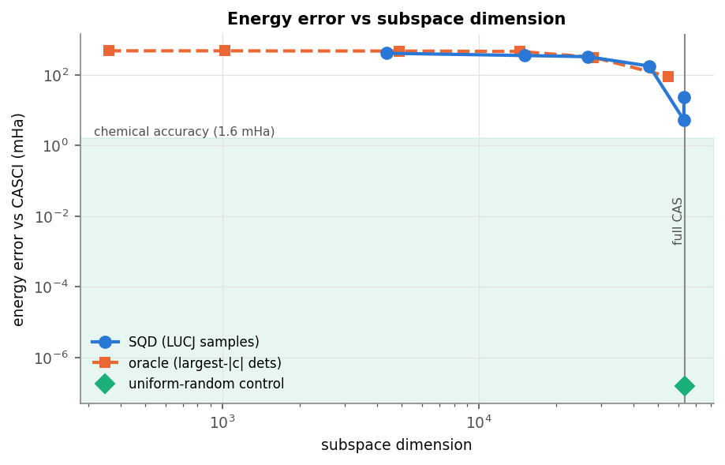
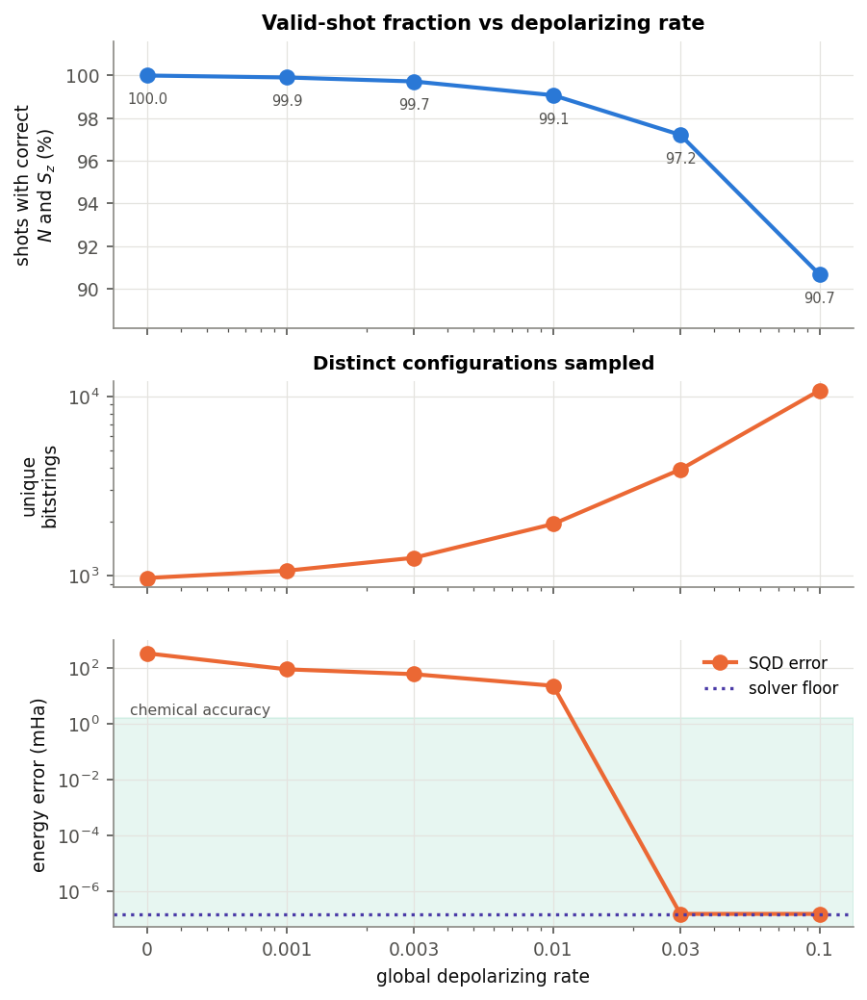
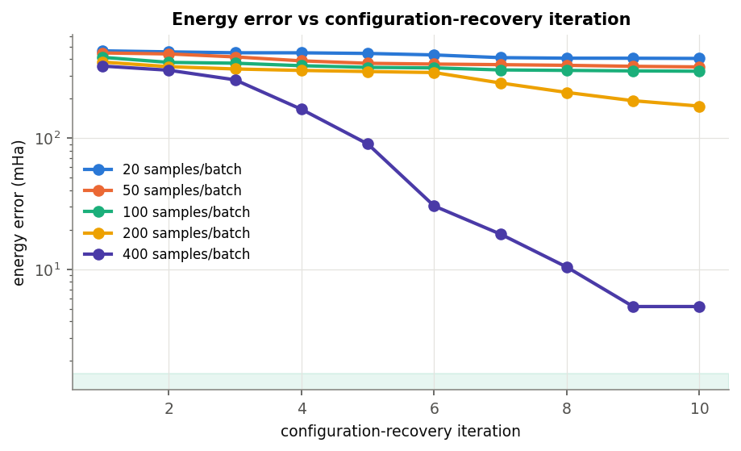
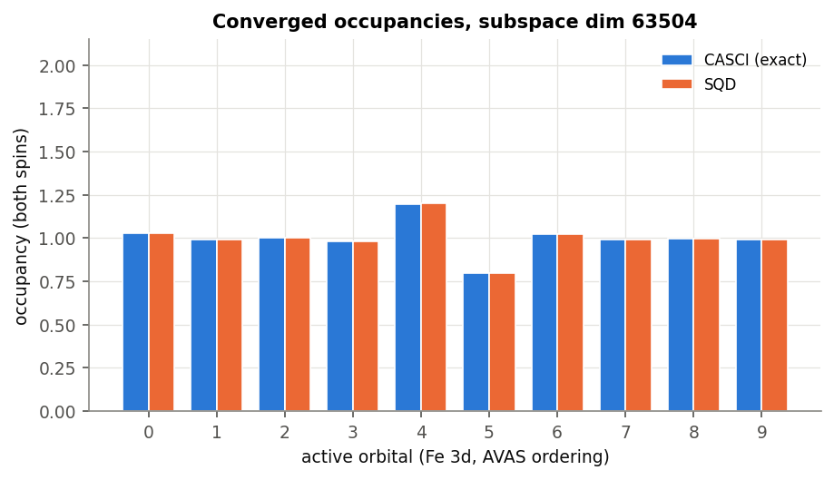
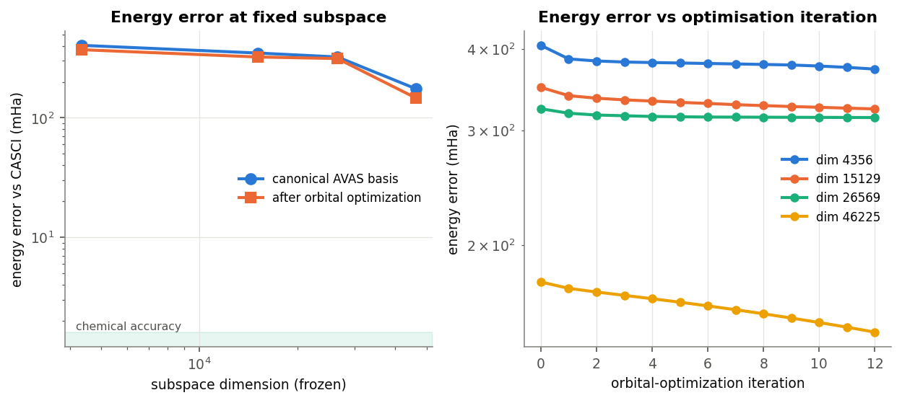
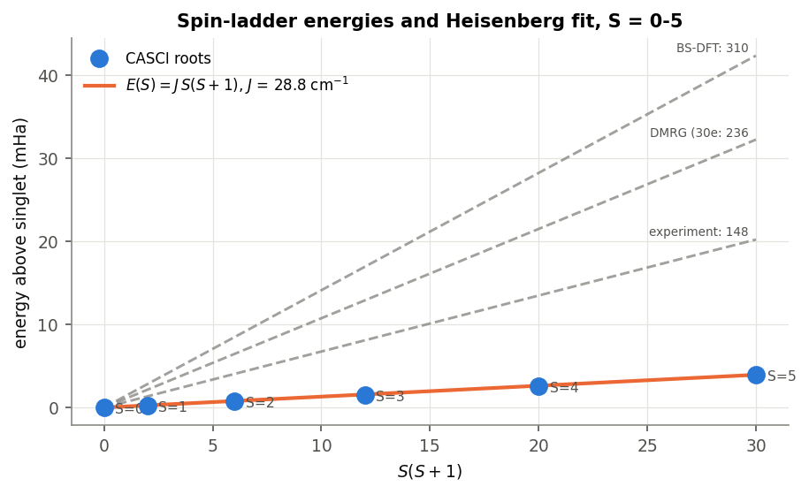

# SQD for a [2Fe-2S(SMe)4]2- model cluster - results

Generated by `src/stage3_report.py`. All energies in hartree; all errors
relative to the CASCI (= full CI in the active space) singlet.

## System

| quantity | value |
|---|---|
| basis | sto-3g |
| atoms / AOs / electrons | 24 / 122 / 186 |
| active space | (10e, 10o) Fe 3d via AVAS (threshold 0.5) |
| qubits | 20 |
| CAS dimension | 63504 determinants |
| RHF | -5012.99869566 |
| CCSD (frozen core) | -5013.22114778 **(not converged)** |
| **CASCI singlet (ground truth)** | **-5013.64906670** |

## Baselines

Three tiers, in the order they matter: what we ran classically, what the
literature reports (classical *and* quantum), and what we ran on the quantum
side. Energies in hartree; `J` in cm^-1 with the Fe-S convention
`H = 2 J S1.S2`, `E(S) = J S(S+1)`, `J > 0` antiferromagnetic.

### Tier 1 - classical baselines, this work

| method | energy (Ha) | error vs CASCI | notes |
|---|---|---|---|
| RHF | -5012.998696 | +650.4 mHa | closed-shell singlet, needed a second-order solver to converge |
| CCSD (frozen core) | -5013.221148 | +427.9 mHa | **did not converge** - the diagnostic that this system is outside single-reference range |
| **CASCI (10e,10o)** | **-5013.649067** | **0 (exact in-space reference)** | full CI in the active space; 63504 determinants |
| selected-CI, largest-|c| dets | -5013.193374 | +455.7 mHa | at subspace dim 14400; the classical analogue of SQD |
| CASCI Heisenberg fit | - | - | **J = 28.8 cm^-1** |

### Tier 2 - published reference values for this cluster

| method | J / accuracy | source | notes |
|---|---|---|---|
| DMRG-CI (30e,20o), TZP-DKH | J = 236 cm^-1 | Sharma, Sivalingam, Neese & Chan, Nat. Chem. 6, 927 (2014); arXiv:1408.5080 | minimal full-valence space: Fe 3d + bridging S 3p + one 3p per terminal S; M up to 3500 |
| DMRG-CI (30e,32o) | - | same | adds Fe 4s/4d for double-shell dynamic correlation |
| BS-DFT | J = 310 cm^-1 | cited in the same work | broken-symmetry DFT; describes a weighted average over spin states |
| Experiment (magnetic susceptibility) | J = 148 +/- 16 cm^-1 | fit on a similar synthetic dimer, cited in the same work | the ground truth that matters |
| *(quantum)* SQD, LUCJ on QPU, (30e,20o) | agrees with HCI to within tens of mHa | Robledo-Moreno et al., 'Chemistry Beyond Exact Solutions on a Quantum-Centric Supercomputer', arXiv:2405.05068 | same [2Fe-2S] cluster and the same minimal full-valence space; [4Fe-4S] at (54e,36o) on up to 77 qubits; accuracy assessed by energy-variance extrapolation, and orbital occupation numbers reported |

### Tier 3 - quantum baselines, this work

Ansatz: LUCJ from frozen-core CCSD `t1`/`t2`, `n_reps=4`, `optimize=False`. Sampled on `ffsim` (global depolarizing 0.01), 100000 shots. Circuit depth 1192, 2564 two-qubit gates.

| run | energy (Ha) | error vs CASCI | subspace dim | <S^2> |
|---|---|---|---|---|
| LUCJ ansatz expectation value (no SQD) | -5013.176515 | +472.6 mHa | - | - |
| **SQD, best** | **-5013.649067** | **+0.0000 mHa** | 63504 | 0.0000 |
| SQD on uniform-random bitstrings (control) | -5013.649067 | +0.0000 mHa | 63504 | 0.0000 |
| SQD + orbital optimization (frozen subspace) | -5013.502160 | +146.9 mHa | 46225 | - |

**Verdict.** On energy we are *exact* against the in-space reference, which is a
stronger result than the published SQD run on this cluster (tens of mHa vs HCI) -
but only because our active space is small enough to diagonalize exactly, so this
is a validation of the pipeline, not a demonstration of quantum advantage.
On the metric the field actually reports, **J = 28.8 cm^-1 against DMRG's 236 and experiment's 148 +/- 16** - low by roughly a
factor of eight. The cause is the active space and basis, not the solver:
Fe 3d only means no bridging-sulfur 3p superexchange pathway, and STO-3G is a
minimal basis where the literature uses TZP-DKH.

## Headline

- Best SQD energy: **-5013.64906670** (**+0.000 mHa**) at subspace dimension 63504 (100.0% of the CAS space), ⟨S²⟩ = 0.0000.
- Diagonalizing the *entire* CAS space through the same selected-CI solver leaves +0.000 mHa, so that is the floor for every number here - not a property of the sampling.
- The LUCJ ansatz itself sits +472.6 mHa above CASCI with a participation ratio of 2.68; SQD's accuracy comes from the classical diagonalization, not from the ansatz energy.
- A uniform-random-bitstring control reaches +0.000 mHa at dimension 63504. At this active-space size the circuit's distribution carries no advantage over random configurations.

## Energy vs subspace dimension

| samples/batch | subspace dim | % of CAS | E (Ha) | error (mHa) | ⟨S²⟩ |
|---|---|---|---|---|---|
| 20 | 4356 | 6.9% | -5013.24405107 | +405.0156 | 0.0883 |
| 50 | 15129 | 23.8% | -5013.29998075 | +349.0860 | 0.0478 |
| 100 | 26569 | 41.8% | -5013.32540173 | +323.6650 | 0.0185 |
| 200 | 46225 | 72.8% | -5013.47366550 | +175.4012 | 0.1606 |
| 400 | 63001 | 99.2% | -5013.64387090 | +5.1958 | 0.0080 |
| 800 | 63001 | 99.2% | -5013.62638183 | +22.6849 | 0.0371 |

Selected-CI reference: keep the largest-|c| CASCI determinants and diagonalize in
the product closure of their spin-up and spin-down strings. Note this is a
*reference strategy*, not an upper bound - the product closure drags in many
low-weight configurations, and at small dimensions SQD's sampled subspace actually
beats it:

| dets kept | subspace dim | error (mHa) |
|---|---|---|
| 25 | 361 | +474.6957 |
| 50 | 1024 | +473.7806 |
| 100 | 4900 | +467.1842 |
| 200 | 14400 | +455.6923 |
| 400 | 27889 | +311.8475 |
| 800 | 54756 | +89.4483 |

## Sampling efficiency vs noise

| depolarizing rate | valid shots (correct N and Sz) | unique bitstrings | subspace dim | error (mHa) | ⟨S²⟩ |
|---|---|---|---|---|---|
| 0 | 100.00% | 972 | 24964 | +328.9893 | 0.0321 |
| 0.001 | 99.91% | 1067 | 55696 | +88.1857 | 0.1055 |
| 0.003 | 99.72% | 1259 | 59049 | +59.0066 | 0.0731 |
| 0.01 | 99.08% | 1943 | 63001 | +22.6849 | 0.0371 |
| 0.03 | 97.22% | 3908 | 63504 | +0.0000 | 0.0000 |
| 0.1 | 90.67% | 10785 | 63504 | +0.0000 | 0.0000 |

## Configuration-recovery convergence

## Orbital occupancies

Maximum per-orbital deviation from CASCI: **0.0011** electrons; the exact occupancies are all close to 1.0, i.e. a half-filled, open-shell d manifold on both irons.

## Orbital optimization at fixed subspace

The subspace is frozen to the configurations SQD found and only the orbital
basis is varied, so any energy drop here is genuine compression rather than a
larger subspace (port of the package's `optimize_orbitals` guide).

| subspace dim | % of CAS | error before OO (mHa) | error after OO (mHa) | gain |
|---|---|---|---|---|
| 4356 | 6.9% | +405.016 | +372.378 | 1.1x |
| 15129 | 23.8% | +349.086 | +323.507 | 1.1x |
| 26569 | 41.8% | +323.665 | +313.762 | 1.0x |
| 46225 | 72.8% | +175.401 | +146.907 | 1.2x |

Best after optimization: **+146.907 mHa** at subspace dimension 46225 (72.8% of the CAS space), from +175.401 mHa at the same dimension in the canonical AVAS basis.

**Orbital optimization does not rescue the compression here.** It recovers 28.5 mHa of a 175 mHa gap (16%), and the traces flatten after a few iterations. That is consistent with the
structure of the exact state rather than a bad choice of basis: in this basis
the CASCI singlet has a participation ratio of 1957 and needs 7171 determinants for 99% of its weight, out of 63504. A wavefunction
that flat has no compact product subspace to find, so neither a better basis
nor more shots helps much - only covering most of the space does.

## Physics: the spin ladder and the exchange coupling

| S | ⟨S²⟩ | E (Ha) | above singlet (mHa) |
|---|---|---|---|
| 0 | 0.0000 | -5013.64906670 | 0.0000 |
| 1 | 2.0000 | -5013.64882205 | 0.2447 |
| 2 | 6.0000 | -5013.64832545 | 0.7413 |
| 3 | 12.0000 | -5013.64756148 | 1.5052 |
| 4 | 20.0000 | -5013.64650476 | 2.5619 |
| 5 | 30.0000 | -5013.64511653 | 3.9502 |

The six roots follow the Landé interval rule to 4.0e-05 Ha, giving **J = 28.8 cm⁻¹** (convention H = 2 J S1.S2, E(S) = J S(S+1); J > 0 is antiferromagnetic). Oxidized synthetic and protein [2Fe-2S] centres sit near -150 to -400 cm⁻¹, so an Fe-3d-only active space in this basis underestimates the antiferromagnetic coupling by roughly an order of magnitude. The bridging-sulfur 3p superexchange pathways are missing from the active space, and no amount of extra sampling can recover them.

## What this says about SQD here

1. **The pipeline reproduces exact diagonalization.** Post-selection plus
   self-consistent configuration recovery drives the energy to the solver floor
   and the occupancies to the CASCI values, with ⟨S²⟩ driven to ~0.
2. **It does so by covering essentially the whole CAS space, not by compressing
   it.** The subspace SQD builds is a Cartesian product of the sampled spin-up
   and spin-down strings, and in the canonical AVAS orbital basis the exact
   singlet has a participation ratio of 1957 with 7171 determinants needed for 99%
   of the weight. Any sampler with modest diversity therefore reconstructs the
   full space, which is why the uniform-random control matches the circuit.
3. **The 1.6 mHa target is the wrong yardstick for this system.** The entire
   spin ladder spans 3.95 mHa,
   so chemical accuracy does not distinguish a singlet from a septet here. The
   meaningful target is the ladder spacing itself, which is what J depends on.
4. **The binding constraint is the active space, not the solver.** Getting J
   right needs the bridging-S 3p orbitals; that is the direction a larger run
   should go, and it is also where the CAS space becomes too large to
   diagonalize exactly - i.e. where SQD would start to earn its keep.

### Caveats

- The frozen-core CCSD that seeds the LUCJ amplitudes **did not converge** (|t2|max is large) - expected for a half-filled 3d shell, and the reason the
  ansatz energy is poor. The amplitudes are still usable as a sampling
  distribution, which is all SQD asks of them.
- Hardware noise is emulated with ffsim's global depolarizing channel rather
  than a device noise model, so the valid-shot fractions are indicative only.
- The geometry is an idealized model cluster, not a relaxed or crystal structure.

